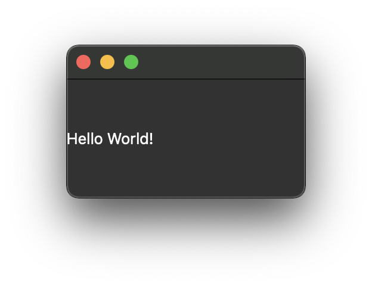

# python-pyside6-hello
A minimal ["hello-world"](https://en.wikipedia.org/wiki/%22Hello,_World!%22_program) application to start code with [Qt for Python](https://doc.qt.io/qtforpython/index.html)


[](image.png)

# Install dependencies

## Activate venv

Using Python 3.6+ and [venv](https://docs.python.org/3/library/venv.html) library create a virtual environment.

```
python3 -m venv env
```

Activate the venv. Use next for Linux and macOS
```
source env/bin/activate 
```

This for Windows
```
env\Scripts\activate.bat
```

## Install packages
Install PySide package via [requirements](./requirements.txt) file
```
pip install -f requirements.txt
```

# Run

Run an applicalion
```
python3 main.py
```

# Useful links

- [Getting started](https://doc.qt.io/qtforpython/quickstart.html)
- [Documentation](https://doc.qt.io/qtforpython/contents.html)
- [Deployment](https://doc.qt.io/qtforpython/deployment-pyinstaller.html)